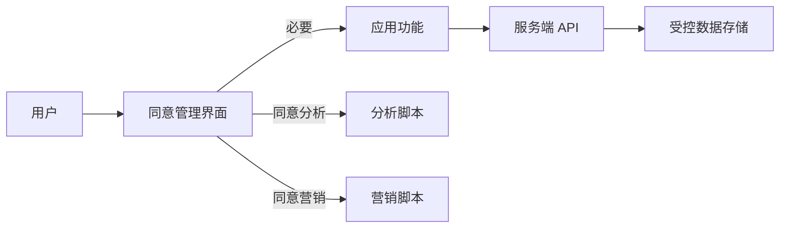

# V.16 法律、合规与隐私

随着数据隐私法规的日益严格和用户隐私保护意识的提高，前端开发者在构建应用时必须将法律、合规与隐私保护纳入核心设计考量。这不仅是法律要求，更是建立用户信任、维护品牌声誉的关键。

## **V.16.1 GDPR, CCPA 等隐私法规对前端的要求**

[**GDPR (General Data Protection Regulation)**](https://gdpr.eu/) 是欧盟的一项数据保护法规，无论组织位于何处，只要处理欧盟居民的个人数据，就要受到严格约束。[**CCPA (California Consumer Privacy Act)**](https://oag.ca.gov/privacy/ccpa) 是美国加州的一项类似法规。这些法规对前端开发的影响主要体现在：

- **用户同意 (Consent)**：在收集、处理用户个人数据（包括通过 Cookie、跟踪器、分析工具收集的数据）之前，必须获得用户的明确、知情同意。前端需要实现同意管理平台（Consent Management Platform, CMP），向用户清晰展示数据收集目的，并提供易于操作的同意/拒绝选项。
- **数据最小化**：只收集必要的个人数据，并确保数据在传输和存储过程中的安全。
- **用户权利**：用户有权访问、更正、删除个人数据，并反对数据处理。前端可能需要提供相应的界面或功能，让用户行使这些权利。
- **透明度**：前端应用应清晰告知用户数据收集的类型、目的和处理方式，通常通过隐私政策和 Cookie 政策说明。
- **安全措施**：前端在数据传输过程中应强制使用 HTTPS，并确保敏感数据不会在客户端泄露。

## **V.16.2 Cookie 管理与用户同意（Consent Management）的最佳实践**

Cookie 是 Web 应用中广泛使用的技术，但也常常用于用户追踪和个性化广告，因此成为隐私法规关注的重点。

- **明确区分 Cookie 类型**：
  - **必要 Cookie**：维持网站基本功能（如会话管理、购物车）所需，通常无需用户同意。
  - **功能性 Cookie**：增强用户体验（如记住偏好设置），可能需要同意。
  - **分析/性能 Cookie**：用于网站分析和性能优化，通常需要同意。
  - **营销/追踪 Cookie**：用于个性化广告和用户追踪，必须获得明确同意。
- **实施同意管理平台 (CMP)**：
  - 在用户首次访问网站时，通过弹窗或横幅清晰告知用户 Cookie 的使用情况，并提供详细的同意选项（例如，允许用户选择接受哪些类型的 Cookie）。
  - 在用户明确同意之前，阻止加载非必要的 Cookie 和追踪脚本。
  - 提供方便的界面，让用户随时修改同意偏好。
- **前端技术实现**：
  - **脚本阻塞**：在获得用户同意之前，使用 JavaScript 动态加载或阻塞非必要的第三方脚本（如 Google Analytics、广告脚本）。
  - **Cookie 设置控制**：在设置 Cookie 时，确保正确配置 SameSite、Secure 和 HttpOnly 属性（对于后端设置的 Cookie），以增强安全性。
  - **用户数据删除**：用户请求删除数据时，前端需要确保清除本地存储（LocalStorage、SessionStorage、IndexedDB）中的相关信息，并通知后端删除数据。

法律、合规与隐私的考量，将前端开发从纯粹的技术实现延伸到法律和伦理层面。随着全球数据隐私法规的收紧，前端工程师需要将隐私保护和合规性内置到产品设计和开发流程中。这反映了现代软件开发对“责任”和“信任”的更高要求。专业级前端工程师需要理解这些法规的核心原则，并掌握如何在技术层面实现用户同意管理、数据最小化和安全实践，构建出功能强大、合法合规、赢得用户信任的 Web 产品。

## **V.16.3 用数据流和同意状态表达隐私边界**



前端可以把同意结果收敛成明确状态，再决定是否加载第三方脚本：

```ts
type Consent = {
  necessary: true;
  analytics: boolean;
  marketing: boolean;
};

export function applyConsent(consent: Consent) {
  if (consent.analytics) loadScript("/analytics.js");
  if (consent.marketing) loadScript("/marketing.js");
}

function loadScript(src: string) {
  const script = document.createElement("script");
  script.src = src;
  script.async = true;
  document.head.append(script);
}
```

加载前应核对数据用途、供应商、保存周期、撤回行为和所在市场的法律要求。日志、LocalStorage、IndexedDB、Cookie 和第三方 SDK 都应进入数据清单。

::: details 启发式示例：基于 Consent Mode 的第三方脚本安全按需加载

**违规反模式：在 HTML 中无条件直接加载第三方追踪脚本**
```html
<head>
  <!-- 违规：用户尚未同意，即已直接向第三方服务器发送包含 IP 和设备指纹的请求 -->
  <script src="https://analytics.example.com/tracker.js" async></script>
</head>
```

**合规推荐实践：通过同意状态机控制动态注入与撤回**
```ts
export type ConsentPreferences = {
  necessary: true; // 始终为 true
  analytics: boolean;
  marketing: boolean;
};

class ConsentManager {
  private preferences: ConsentPreferences = {
    necessary: true,
    analytics: false,
    marketing: false,
  };

  constructor() {
    this.restoreFromStorage();
  }

  private restoreFromStorage() {
    try {
      const stored = localStorage.getItem("user_consent");
      if (stored) {
        this.preferences = { ...this.preferences, ...JSON.parse(stored) };
        this.apply();
      }
    } catch {
      // 容错处理
    }
  }

  public updateConsent(updates: Partial<ConsentPreferences>) {
    this.preferences = { ...this.preferences, ...updates };
    localStorage.setItem("user_consent", JSON.stringify(this.preferences));
    this.apply();
  }

  private apply() {
    if (this.preferences.analytics) {
      this.loadScriptOnce("analytics-sdk", "https://analytics.example.com/tracker.js");
    }
    if (this.preferences.marketing) {
      this.loadScriptOnce("marketing-pixel", "https://ads.example.com/pixel.js");
    }
  }

  private loadScriptOnce(id: string, src: string) {
    if (document.getElementById(id)) return;
    const script = document.createElement("script");
    script.id = id;
    script.src = src;
    script.async = true;
    document.head.appendChild(script);
  }
}

export const consentManager = new ConsentManager();
```

通过将第三方脚本注入权限严格绑定到 `ConsentManager` 状态机上，确保在用户点击同意前，浏览器不会向任何第三方数据收集域名发出任何网络请求，从技术底层杜绝违规风险。

:::

## **V.16.4 EU AI Act 与前端人工智能功能透明度合规**

随着 [**EU AI Act (欧盟人工智能法案)**](https://digital-strategy.ec.europa.eu/en/policies/regulatory-framework-ai) 的分阶段生效，前端涉及 AI 交互的应用必须满足严格的透明度与反欺诈红线：

1. **生成式内容显式披露 (AI Content Disclosure)**：页面中由大模型生成的文本、图像、视频或合成语音，必须在 UI 层面提供明确的人类可读标识（如“由 AI 辅助生成”）与元数据水印。
2. **AI 对话知情权**：当用户在与智能客服或 AI 助理交互时，界面必须在一开始明确告知用户“当前正在与 AI 系统对话”，严禁伪装为真人客服。
3. **禁止操纵性暗黑模式 (Dark Patterns)**：严禁利用 AI 个性化推荐诱导用户做出非理性的高危财务或隐私授权决策。

## **V.16.5 开源软件供应链与许可证 (License) 治理**

现代前端项目平均依赖数百个 npm 模块，开源许可证合规与依赖安全直接关系到企业的商业法律风险：

1. **常见许可证分类与传染性约束**：
   - **宽松型 (Permissive)**：MIT、Apache 2.0、BSD。允许闭源商业使用与修改，只需保留原始版权声明，属于最安全的依赖类型。
   - **强传染型 (Copyleft)**：GPL、AGPL。若前端代码打包（Bundle）中直接静态链接了 GPL 模块，可能导致整个前端项目乃至后端代码被强制要求按照 GPL 开源。
   - **商业化协议变更 (BSL / SSPL)**：需密切关注部分开源基础设施（如 Redis、Elasticsearch 等历史协议变迁）的二次分发约束，避免在商业 SaaS 产品中违规打包。
2. **SBOM (软件物料清单) 与自动化 CVE 审计**：
   - 在 CI 流程中集成 `pnpm audit`、Socket.dev、Snyk 等依赖安全审计工具，对 npm 依赖进行依赖图谱静态扫描，防范恶意脚本注入（Typosquatting）、凭据窃取与越权漏洞。
